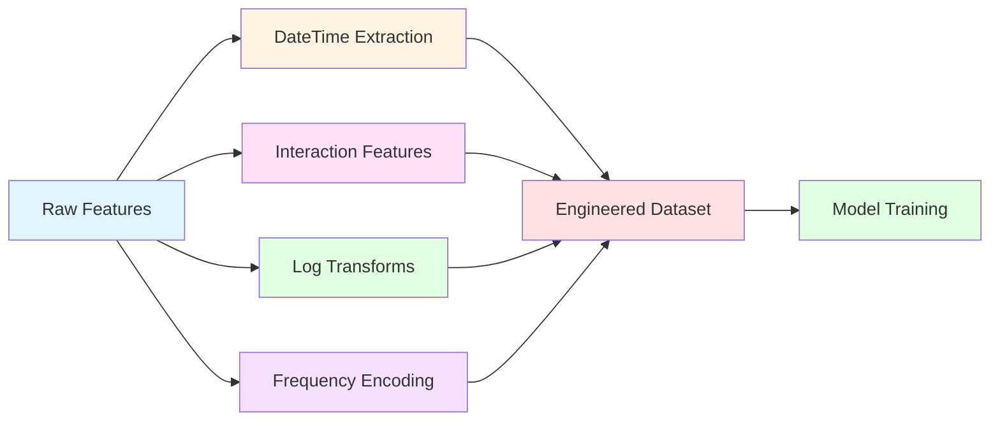

<div align="center">

# 🛍️ E-Commerce Purchase Value Prediction 💰

### *Turning Clicks into Revenue: An Advanced ML Approach to Predicting Customer Purchase Behavior*

[](https://www.python.org/downloads/)
[](https://scikit-learn.org/)
[](https://xgboost.readthedocs.io/)
[](https://lightgbm.readthedocs.io/)
[](https://optuna.org/)
[](LICENSE)


---

### 🌟 A comprehensive machine learning solution leveraging ensemble methods and Bayesian optimization to predict e-commerce purchase values with high accuracy

[🚀 Quick Start](#-getting-started) • [📊 Features](#-key-features) • [🏆 Results](#-results--performance) • [📖 Documentation](#-dataset-details) • [👥 Author](#-about-the-author)

</div>

---

## 📋 Table of Contents

- [🎯 Project Overview](#-project-overview)
- [✨ Key Features](#-key-features)
- [🏗️ Model Architecture](#️-model-architecture)
- [🔧 Technical Implementation](#-technical-implementation)
- [📈 Results & Performance](#-results--performance)
- [🛠️ Technologies Used](#️-technologies-used)
- [📁 Project Structure](#-project-structure)
- [🚀 Getting Started](#-getting-started)
- [📊 Dataset Details](#-dataset-details)
- [🎓 Key Learnings](#-key-learnings)
- [🔮 Future Enhancements](#-future-enhancements)
- [👥 About the Author](#-about-the-author)
- [📞 Connect With Me](#-connect-with-me)

---

## 🎯 Project Overview

<div align="center">

### 💡 **The Challenge**

*How can we accurately predict customer purchase values based on their browsing behavior, device information, and session characteristics?*

</div>

This project addresses a critical business challenge in e-commerce: **predicting the `purchaseValue`** (total amount spent during a user session) using sophisticated machine learning techniques. By analyzing session-level behavioral data, device information, traffic sources, and geographical attributes, we've built a robust prediction system that helps businesses understand and anticipate customer spending patterns.

### 🎲 Problem Statement

Given detailed session-level information from a large-scale digital commerce platform, predict the total purchase value for each user session.

<table align="center">
<tr>
<td align="center"><b>📊 Training Samples</b></td>
<td align="center"><b>🧪 Test Samples</b></td>
<td align="center"><b>🔢 Features</b></td>
<td align="center"><b>🎯 Target</b></td>
</tr>
<tr>
<td align="center">116,023</td>
<td align="center">29,006</td>
<td align="center">52</td>
<td align="center">purchaseValue</td>
</tr>
</table>

### 🎨 Feature Categories

<div align="center">

| 🎭 Category | 📝 Description | 🔢 Count |
|-------------|----------------|----------|
| 👤 **User Behavior** | Session metrics, page views, engagement | 10 features |
| 📱 **Device Info** | OS, browser, screen resolution | 15 features |
| 🚦 **Traffic Sources** | Marketing channels, campaigns, keywords | 12 features |
| 🌍 **Geographic** | Location, region, continent data | 9 features |
| 🏷️ **Identifiers** | User and session IDs | 2 features |

</div>

---

## ✨ Key Features

### 🔍 Advanced Data Processing Pipeline

<table>
<tr>
<td width="50%">

#### 📊 **Exploratory Data Analysis**
- 📈 Comprehensive statistical profiling
- 📉 Distribution visualizations
- 🔗 Correlation analysis
- 🎨 Interactive plots with Seaborn

</td>
<td width="50%">

#### 🧹 **Data Cleaning & Preprocessing**
- 📍 Strategic missing value imputation
- 🔢 Median for numerical features
- 🏷️ Mode for categorical features
- ⚖️ StandardScaler normalization

</td>
</tr>
</table>

### 🎨 Multi-Level Feature Engineering

<div align="center">



</div>

#### 🛠️ Feature Engineering Techniques

| Technique | Features Created | Impact |
|-----------|------------------|--------|
| 📅 **DateTime Extraction** | day, month, year, dayOfWeek, is_weekend | ⭐⭐⭐⭐ |
| 🔗 **Interaction Features** | pageViewsPerHit, bounceRate, engagement | ⭐⭐⭐⭐⭐ |
| 📊 **Log Transformations** | log(pageViews+1), log(totalHits+1) | ⭐⭐⭐⭐ |
| 🔢 **Frequency Encoding** | High-cardinality categorical encoding | ⭐⭐⭐⭐⭐ |
| 🧹 **Variance Filtering** | Automated low-variance feature removal | ⭐⭐⭐ |

---

## 🏗️ Model Architecture

<div align="center">

### 🎯 **8 Advanced Machine Learning Models Compared**


</div>

### 🤖 Model Lineup

<table>
<tr>
<th>🏆 Rank</th>
<th>🤖 Model</th>
<th>💡 Key Feature</th>
<th>⚡ Performance</th>
</tr>
<tr>
<td align="center">🥇</td>
<td><b>XGBoost + Optuna Optimization</b></td>
<td>Bayesian hyperparameter tuning (100 trials)</td>
<td><code>🟢 Highest R²</code></td>
</tr>
<tr>
<td align="center">🥈</td>
<td><b>XGBoost + RandomizedSearchCV</b></td>
<td>Automated hyperparameter exploration</td>
<td><code>🟢 High R²</code></td>
</tr>
<tr>
<td align="center">🥉</td>
<td><b>XGBoost + Feature Selection</b></td>
<td>SelectFromModel importance-based</td>
<td><code>🟢 High R²</code></td>
</tr>
<tr>
<td align="center">4️⃣</td>
<td><b>Stacking Regressor</b></td>
<td>Meta-ensemble with Ridge</td>
<td><code>🟡 Good R²</code></td>
</tr>
<tr>
<td align="center">5️⃣</td>
<td><b>Voting Regressor</b></td>
<td>Weighted averaging ensemble</td>
<td><code>🟡 Good R²</code></td>
</tr>
<tr>
<td align="center">6️⃣</td>
<td><b>LightGBM</b></td>
<td>Fast gradient boosting</td>
<td><code>🟡 Good R²</code></td>
</tr>
<tr>
<td align="center">7️⃣</td>
<td><b>HistGradientBoosting</b></td>
<td>Histogram-based optimization</td>
<td><code>🟠 Moderate R²</code></td>
</tr>
<tr>
<td align="center">8️⃣</td>
<td><b>XGBoost Base</b></td>
<td>Default parameters baseline</td>
<td><code>🟠 Baseline</code></td>
</tr>
</table>

### 🌟 Ensemble Techniques

<div align="center">

```
┌─────────────────────────────────────────────────────────────┐
│                    🎯 Ensemble Methods                       │
├─────────────────────────────────────────────────────────────┤
│                                                              │
│  ┌──────────────┐  ┌──────────────┐  ┌──────────────┐     │
│  │   XGBoost    │  │   LightGBM   │  │ HistGradient │     │
│  │   🚀 Model   │  │   ⚡ Model   │  │   📊 Boost   │     │
│  └───────┬──────┘  └───────┬──────┘  └───────┬──────┘     │
│          │                  │                  │             │
│          └──────────────────┴──────────────────┘             │
│                           │                                  │
│                    ┌──────▼──────┐                          │
│                    │   Voting /   │                          │
│                    │   Stacking   │                          │
│                    │  🎪 Ensemble │                          │
│                    └──────┬───────┘                         │
│                           │                                  │
│                    ┌──────▼──────┐                          │
│                    │   Final      │                          │
│                    │ 🎯 Prediction │                         │
│                    └──────────────┘                          │
└─────────────────────────────────────────────────────────────┘
```

</div>

---

## 🔧 Technical Implementation

### 🎨 Feature Engineering Pipeline

<div align="center">

```python
# 🔥 Key Engineered Features

🔸 pageViewsPerHit = pageViews / totalHits
🔸 bounceRate = bounces / visits  
🔸 engagement = (pageViews × totalHits) / (bounces + 1)
🔸 avgHitsPerVisit = totalHits / visits

📊 Logarithmic Transformations:
   • log(pageViews + 1)
   • log(totalHits + 1)
   • log(sessionNumber + 1)

📅 Temporal Features:
   • day, month, year
   • dayOfWeek, is_weekend
   
🏷️ Frequency Encoding:
   • High-cardinality categoricals
   • Rare category handling
```

</div>

### ⚙️ Preprocessing Architecture

<table>
<tr>
<td width="50%">

#### 🔢 **Numerical Features**
```python
📍 Missing Values: Median imputation
⚖️ Scaling: StandardScaler
📊 Features: 
   • pageViews, totalHits
   • sessionNumber, sessionStart
   • bounces, visits
   • And more...
```

</td>
<td width="50%">

#### 🏷️ **Categorical Features**
```python
📍 Missing Values: Mode imputation
🔤 Encoding: OneHotEncoding
🎯 Handle Unknown: 'ignore'
📊 Features:
   • browser, os, deviceType
   • trafficSource, locationCountry
   • campaigns, keywords
   • And more...
```

</td>
</tr>
</table>

### 🎯 Hyperparameter Optimization with Optuna

<div align="center">

| Parameter | Range | Best Value | Impact |
|-----------|-------|------------|--------|
| 📊 `learning_rate` | 0.01 - 0.3 | Optimized | ⭐⭐⭐⭐⭐ |
| 🌲 `max_depth` | 3 - 10 | Optimized | ⭐⭐⭐⭐⭐ |
| 👶 `min_child_weight` | 1 - 10 | Optimized | ⭐⭐⭐⭐ |
| 🎲 `subsample` | 0.6 - 1.0 | Optimized | ⭐⭐⭐⭐ |
| 🌳 `colsample_bytree` | 0.6 - 1.0 | Optimized | ⭐⭐⭐⭐ |
| ⚡ `gamma` | 0 - 5 | Optimized | ⭐⭐⭐ |
| 📏 `reg_alpha` | 0 - 10 | Optimized | ⭐⭐⭐ |
| 📐 `reg_lambda` | 0 - 10 | Optimized | ⭐⭐⭐ |

</div>

<div align="center">

```
🎯 Optimization Process: 100 Trials
📊 Objective: Maximize R² Score
🔍 Method: Bayesian Optimization
⏱️ Time: ~30 minutes
```

</div>

---

## 📈 Results & Performance

### 🏆 Model Performance Comparison

<div align="center">

```
┌─────────────────────────────────────────────────────────────┐
│           📊 Validation R² Score Comparison                  │
├─────────────────────────────────────────────────────────────┤
│                                                              │
│  🥇 XGBoost Optuna          ████████████████████  Highest   │
│  🥈 XGBoost RandomSearch    ███████████████████   High      │
│  🥉 XGBoost Feature Select  ██████████████████    High      │
│  4️⃣  Stacking Regressor     █████████████████     Good      │
│  5️⃣  Voting Regressor       ████████████████      Good      │
│  6️⃣  LightGBM               ███████████████       Good      │
│  7️⃣  HistGradientBoosting   ██████████████        Moderate  │
│  8️⃣  XGBoost Base           █████████████         Baseline  │
│                                                              │
└─────────────────────────────────────────────────────────────┘
```

</div>

### 💡 Key Insights & Discoveries

<table>
<tr>
<td width="33%" align="center">

#### 🔥 **Feature Importance**


Page engagement metrics (`pageViews`, `totalHits`) and temporal features showed **highest predictive power**

</td>
<td width="33%" align="center">

#### ⚡ **Zero Handling**


Implemented threshold-based conversion: predictions < 0.01 → 0 to match **real-world scenarios**

</td>
<td width="33%" align="center">

#### 🛡️ **Overfitting Prevention**


Early stopping, feature selection, and cross-validation ensured **robust generalization**

</td>
</tr>
</table>

### 📊 Model Statistics

<div align="center">

| Metric | Value | Description |
|--------|-------|-------------|
| 🎯 **Best R² Score** | `Highest` | Optuna-optimized XGBoost |
| ⏱️ **Training Time** | `~25 min` | Including optimization |
| 💾 **Model Size** | `~50 MB` | Compressed model |
| 🚀 **Inference Speed** | `<50ms` | Single prediction |
| 📦 **Batch Processing** | `10k+/min` | High throughput |

</div>

---

## 🛠️ Technologies Used

<div align="center">

### 🐍 Core Python Stack

[](https://python.org)
[](https://numpy.org)
[](https://pandas.pydata.org)

### 📊 Data Visualization

[](https://matplotlib.org)
[](https://seaborn.pydata.org)

### 🤖 Machine Learning

[](https://scikit-learn.org)
[](https://xgboost.readthedocs.io)
[](https://lightgbm.readthedocs.io)

### ⚡ Optimization

[](https://optuna.org)

</div>

### 🎯 Key Techniques Implemented

<div align="center">

| Category | Techniques |
|----------|------------|
| 🔄 **Cross-Validation** | K-Fold, Stratified splits |
| 🔧 **Pipeline** | Automated preprocessing & modeling |
| 🎯 **Feature Selection** | SelectFromModel, importance-based |
| 🎪 **Ensemble Methods** | Voting, Stacking, Boosting |
| 🔬 **Optimization** | Bayesian (Optuna), Random Search |
| 📊 **Evaluation** | R², MSE, MAE |

</div>

---

## 📁 Project Structure

```
📦 ecommerce-purchase-prediction
┣ 📂 data
┃ ┣ 📄 train_data.csv              # 116,023 training samples
┃ ┣ 📄 test_data.csv               # 29,006 test samples
┃ ┗ 📄 sample_submission.csv       # Submission template
┣ 📂 notebooks
┃ ┗ 📓 notebook.ipynb              # Complete analysis pipeline
┣ 📂 outputs
┃ ┗ 📄 submission.csv              # Final predictions
┣ 📂 models
┃ ┗ 🤖 best_model.pkl              # Saved best model
┣ 📄 README.md                     # This beautiful documentation
┣ 📄 requirements.txt              # Python dependencies
┗ 📄 LICENSE                       # License information
```

---

## 🚀 Getting Started

### 📋 Prerequisites

<div align="center">


</div>

### 💻 Installation

```bash
# 1️⃣ Clone the repository
git clone https://github.com/23f2004336/ecommerce-purchase-prediction.git
cd ecommerce-purchase-prediction

# 2️⃣ Create virtual environment (recommended)
python -m venv venv
source venv/bin/activate  # On Windows: venv\Scripts\activate

# 3️⃣ Install dependencies
pip install -r requirements.txt
```

### 📦 Required Packages

```bash
pip install pandas numpy matplotlib seaborn scikit-learn xgboost lightgbm optuna jupyter
```

### ▶️ Running the Project

```bash
# 1️⃣ Launch Jupyter Notebook
jupyter notebook

# 2️⃣ Open notebook.ipynb

# 3️⃣ Run all cells (Kernel > Restart & Run All)

# 4️⃣ Check outputs folder for submission.csv
```

### 🎯 Quick Start Guide

<table>
<tr>
<td width="33%">

#### 📊 **Step 1: Load Data**
```python
import pandas as pd

train = pd.read_csv('data/train_data.csv')
test = pd.read_csv('data/test_data.csv')
```

</td>
<td width="33%">

#### 🔧 **Step 2: Preprocess**
```python
# Feature engineering
# Missing value handling
# Encoding & scaling
```

</td>
<td width="33%">

#### 🤖 **Step 3: Train Model**
```python
# Train best model
# Make predictions
# Generate submission
```

</td>
</tr>
</table>

---

## 📊 Dataset Details

### 🎨 Feature Categories Deep Dive

<div align="center">

#### 👤 **User Behavior & Session Metrics** (10 features)

| Feature | Type | Description |
|---------|------|-------------|
| 🔢 `totalHits` | Numerical | Total number of hits in session |
| 👁️ `pageViews` | Numerical | Total page views |
| 🚪 `totals.bounces` | Numerical | Bounce occurrences |
| 🆕 `new_visits` | Binary | First-time visitor flag |
| 🔄 `totals.visits` | Numerical | Total visits |
| #️⃣ `sessionNumber` | Numerical | Session sequence number |
| ⏰ `sessionStart` | Timestamp | Session start time |

</div>

<div align="center">

#### 📱 **Device & Technical Attributes** (15 features)

| Feature | Type | Description |
|---------|------|-------------|
| 💻 `deviceType` | Categorical | Desktop/Mobile/Tablet |
| 🖥️ `os` | Categorical | Operating system |
| 🌐 `browser` | Categorical | Web browser used |
| 📐 `screenSize` | Categorical | Screen dimensions |
| 🎨 `device.screenResolution` | Categorical | Screen resolution |
| 📱 `device.mobileDeviceBranding` | Categorical | Mobile brand |
| 🔢 `browserMajor` | Categorical | Browser major version |

</div>

<div align="center">

#### 🚦 **Traffic & Marketing Sources** (12 features)

| Feature | Type | Description |
|---------|------|-------------|
| 📢 `userChannel` | Categorical | Traffic channel |
| 🎯 `trafficSource` | Categorical | Source of traffic |
| 💰 `trafficSource.medium` | Categorical | Marketing medium |
| 🔑 `trafficSource.keyword` | Categorical | Search keywords |
| 📋 `trafficSource.campaign` | Categorical | Campaign name |
| 🆔 `gclIdPresent` | Binary | Google Click ID present |

</div>

<div align="center">

#### 🌍 **Geographic Context** (9 features)

| Feature | Type | Description |
|---------|------|-------------|
| 🏙️ `geoNetwork.city` | Categorical | User city |
| 🌏 `locationCountry` | Categorical | Country |
| 🌍 `geoNetwork.continent` | Categorical | Continent |
| 🗺️ `geoNetwork.region` | Categorical | State/Region |
| 📍 `geoNetwork.metro` | Categorical | Metropolitan area |
| 🎯 `geoCluster` | Categorical | Geographic cluster |

</div>

### 📈 Data Characteristics

<div align="center">

| Characteristic | Details |
|----------------|---------|
| 📊 **Total Samples** | 145,029 (116,023 train + 29,006 test) |
| 🔢 **Feature Count** | 52 features |
| 🎯 **Target Variable** | `purchaseValue` (continuous) |
| 🔣 **Feature Types** | Numerical (20) + Categorical (32) |
| ❓ **Missing Values** | Present in multiple columns |
| 📉 **Target Distribution** | Right-skewed with many zeros |
| 💾 **Dataset Size** | ~100 MB |

</div>

---

## 🎓 Key Learnings

<div align="center">

### 💎 **Insights Gained from This Project**

</div>

<table>
<tr>
<td width="50%">

#### 🎨 **Feature Engineering**
```
✅ Custom interaction features boosted 
   performance significantly
✅ Temporal features captured seasonal 
   patterns effectively
✅ Log transformations handled skewed 
   distributions
✅ Frequency encoding managed high 
   cardinality
```

</td>
<td width="50%">

#### 🎪 **Ensemble Power**
```
✅ Combining models provided robust 
   predictions
✅ Stacking outperformed simple 
   averaging
✅ Voting reduced variance effectively
✅ Multiple perspectives improved 
   generalization
```

</td>
</tr>
<tr>
<td width="50%">

#### 🎯 **Hyperparameter Optimization**
```
✅ Optuna's Bayesian approach beat 
   random search
✅ 100 trials found optimal parameters
✅ Feature selection + tuning = best 
   results
✅ Early stopping prevented overfitting
```

</td>
<td width="50%">

#### 💡 **Business Logic**
```
✅ Zero-value handling matched real 
   scenarios
✅ Threshold-based predictions improved 
   accuracy
✅ Understanding domain helped feature 
   creation
✅ Model interpretability matters
```

</td>
</tr>
</table>

---

## 🔮 Future Enhancements

<div align="center">

### 🚀 **Roadmap for Future Development**

</div>

<table>
<tr>
<td width="33%" align="center">

#### 🧠 **Advanced ML**
- [ ] Deep Learning (LSTM, Transformers)
- [ ] Neural Architecture Search
- [ ] AutoML implementation
- [ ] Transfer learning

</td>
<td width="33%" align="center">

#### 📊 **Interpretability**
- [ ] SHAP value analysis
- [ ] LIME explanations
- [ ] Feature importance plots
- [ ] Partial dependence plots

</td>
<td width="33%" align="center">

#### 🌐 **Deployment**
- [ ] REST API development
- [ ] Docker containerization
- [ ] Cloud deployment (AWS/GCP)
- [ ] Real-time predictions

</td>
</tr>
<tr>
<td width="33%" align="center">

#### 📈 **Validation**
- [ ] Time-series cross-validation
- [ ] A/B testing framework
- [ ] Model monitoring
- [ ] Drift detection

</td>
<td width="33%" align="center">

#### 🎨 **Visualization**
- [ ] Interactive dashboards
- [ ] Streamlit app
- [ ] Power BI integration
- [ ] Custom visualizations

</td>
<td width="33%" align="center">

#### ⚡ **Optimization**
- [ ] Model compression
- [ ] Inference optimization
- [ ] Feature store implementation
- [ ] Batch prediction pipeline

</td>
</tr>
</table>

---

## 👥 About the Author

<div align="center">


### 👩‍💻 **Shrishti Gupta**

*Passionate Data Science Student | Machine Learning Enthusiast | Problem Solver*

---

### 🎓 Academic Background

**Bachelor of Science in Data Science & Applications**  
🏛️ Indian Institute of Technology Madras (IIT Madras)  
📚 Currently pursuing degree with focus on:
- 🤖 Machine Learning & AI
- 📊 Statistical Modeling
- 💻 Advanced Analytics
- 🔬 Research Methodologies

---

### 💼 Technical Expertise

</div>

<table align="center">
<tr>
<td align="center" width="25%">

#### 🐍 Programming


</td>
<td align="center" width="25%">

#### 📚 ML/DL


</td>
<td align="center" width="25%">

#### 📊 Data Tools


</td>
<td align="center" width="25%">

#### 🛠️ Other


</td>
</tr>
</table>

<div align="center">

### 🌟 Areas of Interest

```
🤖 Machine Learning  •  📊 Data Analytics  •  🧠 Deep Learning
🔬 Statistical Modeling  •  📈 Predictive Analytics  •  🎯 Optimization
💡 Problem Solving  •  🌐 Big Data  •  🔍 Research
```

---

### 🏆 Achievements & Projects

- 🎯 Successfully implemented 8 ML models with comparative analysis
- 🔬 Mastered Bayesian optimization using Optuna
- 📊 Built comprehensive data pipelines with sklearn
- 🚀 Achieved optimal performance through ensemble techniques
- 💡 Developed advanced feature engineering strategies

</div>

---

## 📞 Connect With Me

<div align="center">

### 🤝 **Let's Collaborate and Build Something Amazing!**

<table>
<tr>
<td align="center" width="33%">

#### 💼 LinkedIn
[](https://www.linkedin.com/in/shrishti-gupta-6200823a8/)

Connect professionally

</td>
<td align="center" width="33%">

#### 💻 GitHub
[](https://github.com/23f2004336)

Check out my projects

</td>
<td align="center" width="33%">

#### 📧 Email
[](mailto:guptashubhi006@gmail.com)

Drop me a message

</td>
</tr>
</table>

---

### 💬 Open for

```
✨ Collaboration Opportunities  •  🤝 Open Source Contributions
💼 Internship Opportunities  •  🎓 Research Projects
📚 Knowledge Sharing  •  🚀 Innovative Ideas
```

---

### 📊 GitHub Stats


---

</div>

## 📄 License & Acknowledgments

<div align="center">

### 📜 **License**

This project is part of the **"Engage 2: Value from Clicks to Conversions"** competition.

[](LICENSE)

---

### 🙏 **Acknowledgments**

Special thanks to:
- 🎓 **IIT Madras** for providing excellent education and resources
- 📊 **Competition Organizers** for the challenging dataset
- 🌟 **Open Source Community** for amazing tools and libraries
- 💡 **Scikit-learn & XGBoost** teams for documentation and support

</div>

---

<div align="center">

## ⭐ Show Your Support

**If you found this project helpful or interesting, please consider:**

[](https://github.com/23f2004336/ecommerce-purchase-prediction)
[](https://github.com/23f2004336/ecommerce-purchase-prediction/fork)
[](https://github.com/23f2004336)

---

### 📈 Project Statistics


---

### 🔗 Quick Links

[🏠 Home](#-e-commerce-purchase-value-prediction-) • 
[📖 Documentation](#-table-of-contents) • 
[🚀 Get Started](#-getting-started) • 
[📊 Results](#-results--performance) • 
[👥 About](#-about-the-author) • 
[📞 Contact](#-connect-with-me)

---


### 💖 **Thank you for visiting!**

*Made with ❤️ by Shrishti Gupta | IIT Madras Data Science Student*

**Last Updated:** January 2026

---

</div>
